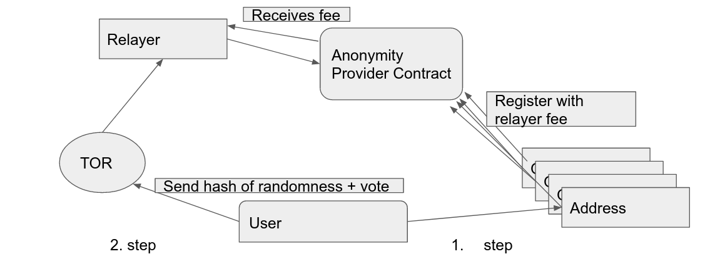
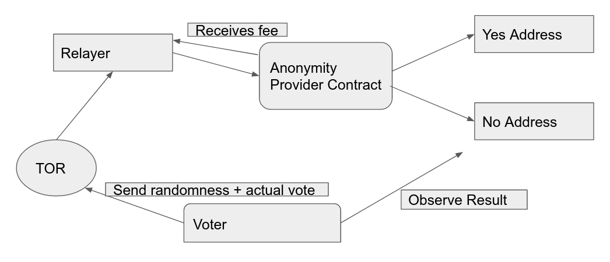

# Tornado Vote (Private Voting based on tornado Cash)

This repo contains a private vote protocol, developed for my Masterthesis, which is an extension of the privacy protocol **[tornado cash](https://github.com/tornadocash/tornado-core)** and an ERC20 token of the **[Open Zeppelin Library v2.4](https://github.com/OpenZeppelin/openzeppelin-contracts/tree/release-v2.4.0)**.

Tornado Cash is a noncustodial mixer which takes in tokens and a commitment, a hash. These commitments are added to a merkle tree. Using a zeroknowledge proof a relayer can withdraw funds to a new address therefore unlinking the original address and the new address achieving certain anonymity.

The voting protcol uses the anonymity of tornado cash to transfer extended ERC20 Vote Tokens to addresses specified at deployment which represent choices for example yes or no. 


**The Voting protocol is composed of three phases:**

**Registration Phase**: The adminstrator deploys the smart contracts and sets the parameters (initialSupply, address yes,address no,block endphase1,block endphase2,block endblockelection, address tornado_contract) and distributes the tokens to eligible voters. After distribution the administrator must retain one or zero vote tokens.

**Commitment Phase**: Transfer token to anonymity provider and retain note. Subsequently, the voter uses the note to submit the first 20 bytes of a sha3 hash H(32 bytes randomness || 1 byte Vote) via a relayer to the anonymity provider which saves the hash in the vote token. This hash is a commitment for the vote to be cast next round to ensure fairness.




**Voting Phase**: The voter submits the inputs for the prior hash commitment in clear text over a relayer to the anonymity provider. The anonymity provider calls the vote token and with the given inputs which checks for the existence of a the first 20 bytes of a sha3 hash corresponding to the inputs. If a corresponding hash is found, it is deleted, and a vote is transferred to the choice given in the last byte of the input for the hash commitment.




**Protocol Properties:**
- self tallying
- vote privacy
- publicly verifiable with ethereum blockexplorer
- fairness
- no single point of failure after registration phase

## Security

Both the original tornado cash protocol and openzeppeling ERC20 token implementation have been audited and are deployed on the Ethereum mainnet today. Of the tornado cash code the withdraw function has been renamed commit and additional input and a function call to 
Since, the code has been modified, in particular the ERC20 token, a new security analyis was conducted using the tools, **[Slither]()**, **[Mythril]()** and **[VeriSol](https://github.com/microsoft/verisol)**. With VeriSol a number of safety properties have been formally verified, for details check the **[VeriSol directory](https://github.com/ananas-block/tornado-vote/tree/master/VeriSol)**.

**Nevertheless, this is still experimental software use at your own risk!**

## Deploy

### Test
`nvm use v11.15.0`

 `npm run build`

`ganache-cli --mnemonic "sock work police cube fine clean early much picture scan foot sure" –networkId 1337`

`npm test ./test/VoteToken.test.js`

### Deploy locally
`nvm use v11.15.0`

`npm run build`

`ganache-cli --mnemonic "sock work police cube fine clean early much picture scan foot sure" –networkId 1337`

 Edit .env file for election configuration

`npm run migrate:dev`

  

./cli.js deposit ETH 0.1 --rpc HTTP://127.0.0.1:8545

./cli.js withdraw tornado-eth-0.1-1337-0xe8c968ba6ea1f4045797ff23c3a316a2a99fdca5833977624ed39a3736cf090d77f5be2aa442d3d0485eee4b3e4542a4031de8a40de73039e3ea6e8206bc 0xB9E73B55b1398217C7dB7d9C3c7f0f5F7Ca888e6 --rpc HTTP://127.0.0.1:8545 --relayer http://127.0.0.1:8000

### Deploy on testnet
todo

# Tornado Cash Privacy Solution [](https://travis-ci.org/tornadocash/tornado-core)

Tornado Cash is a non-custodial Ethereum and ERC20 privacy solution based on zkSNARKs. It improves transaction privacy by breaking the on-chain link between the recipient and destination addresses. It uses a smart contract that accepts ETH deposits that can be withdrawn by a different address. Whenever ETH is withdrawn by the new address, there is no way to link the withdrawal to the deposit, ensuring complete privacy.

To make a deposit user generates a secret and sends its hash (called a commitment) along with the deposit amount to the Tornado smart contract. The contract accepts the deposit and adds the commitment to its list of deposits.

Later, the user decides to make a withdrawal. To do that, the user should provide a proof that he or she possesses a secret to an unspent commitment from the smart contract’s list of deposits. zkSnark technology allows that to happen without revealing which exact deposit corresponds to this secret. The smart contract will check the proof, and transfer deposited funds to the address specified for withdrawal. An external observer will be unable to determine which deposit this withdrawal came from.

You can read more about it in [this medium article](https://medium.com/@tornado.cash/introducing-private-transactions-on-ethereum-now-42ee915babe0)

## Specs

- Deposit gas cost: 1088354 (43381 + 50859 \* tree_depth)
- Withdraw gas cost: 301233
- Circuit Constraints = 28271 (1869 + 1325 \* tree_depth)
- Circuit Proof time = 10213ms (1071 + 347 \* tree_depth)
- Serverless


## Whitepaper

**[TornadoCash_whitepaper_v1.4.pdf](https://tornado.cash/audits/TornadoCash_whitepaper_v1.4.pdf)**

## Was it audited?

Tornado.cash protocols, circuits, and smart contracts were audited by a group of experts from [ABDK Consulting](https://www.abdk.consulting), specializing in zero-knowledge, cryptography, and smart contracts.

During the audit, no critical issues were found and all outstanding issues were fixed. The results can be found here:

- Cryptographic review https://tornado.cash/audits/TornadoCash_cryptographic_review_ABDK.pdf
- Smart contract audit https://tornado.cash/audits/TornadoCash_contract_audit_ABDK.pdf
- Zk-SNARK circuits audit https://tornado.cash/audits/TornadoCash_circuit_audit_ABDK.pdf

Underlying circomlib dependency is currently being audited, and the team already published most of the fixes for found issues

## Requirements

1. `node v11.15.0`
2. `npm install -g npx`

## Usage

You can see example usage in cli.js, it works both in the console and in the browser.

1. `npm install`
1. `cp .env.example .env`
1. `npm run build` - this may take 10 minutes or more
1. `npx ganache-cli`
1. `npm run test` - optionally runs tests. It may fail on the first try, just run it again.

Use browser version on Kovan:

1. `vi .env` - add your Kovan private key to deploy contracts
1. `npm run migrate`
1. `npx http-server` - serve current dir, you can use any other static http server
1. Open `localhost:8080`

Use the command-line version. Works for Ganache, Kovan, and Mainnet:

### Initialization

1. `cp .env.example .env`
1. `npm run download`
1. `npm run build:contract`

### Ganache

1. make sure you complete steps from Initialization
1. `ganache-cli -i 1337`
1. `npm run migrate:dev`
1. `./cli.js test`
1. `./cli.js --help`

### Kovan, Mainnet

1. Please use https://github.com/tornadocash/tornado-cli
   Reason: because tornado-core uses websnark `2041cfa5fa0b71cd5cca9022a4eeea4afe28c9f7` commit hash in order to work with local trusted setup. Tornado-cli uses `4c0af6a8b65aabea3c09f377f63c44e7a58afa6d` commit with production trusted setup of tornadoCash

Example:

```bash
./cli.js deposit ETH 0.1 --rpc https://kovan.infura.io/v3/27a9649f826b4e31a83e07ae09a87448
```

> Your note: tornado-eth-0.1-42-0xf73dd6833ccbcc046c44228c8e2aa312bf49e08389dadc7c65e6a73239867b7ef49c705c4db227e2fadd8489a494b6880bdcb6016047e019d1abec1c7652
> Tornado ETH balance is 8.9
> Sender account ETH balance is 1004873.470619891361352542
> Submitting deposit transaction
> Tornado ETH balance is 9
> Sender account ETH balance is 1004873.361652048361352542

```bash
./cli.js withdraw tornado-eth-0.1-42-0xf73dd6833ccbcc046c44228c8e2aa312bf49e08389dadc7c65e6a73239867b7ef49c705c4db227e2fadd8489a494b6880bdcb6016047e019d1abec1c7652 0x8589427373D6D84E98730D7795D8f6f8731FDA16 --rpc https://kovan.infura.io/v3/27a9649f826b4e31a83e07ae09a87448 --relayer https://kovan-frelay.duckdns.org
```

> Relay address: 0x6A31736e7490AbE5D5676be059DFf064AB4aC754
> Getting current state from tornado contract
> Generating SNARK proof
> Proof time: 9117.051ms
> Sending withdraw transaction through the relay
> Transaction submitted through the relay. View transaction on etherscan https://kovan.etherscan.io/tx/0xcb21ae8cad723818c6bc7273e83e00c8393fcdbe74802ce5d562acad691a2a7b
> Transaction mined in block 17036120
> Done

## Deploy ETH Tornado Cash

1. `cp .env.example .env`
1. Tune all necessary params
1. `npx truffle migrate --network kovan --reset --f 2 --to 4`

## Deploy ERC20 Tornado Cash

1. `cp .env.example .env`
1. Tune all necessary params
1. `npx truffle migrate --network kovan --reset --f 2 --to 3`
1. `npx truffle migrate --network kovan --reset --f 5`

**Note**. If you want to reuse the same verifier for all the instances, then after you deployed one of the instances you should only run the 4th or 5th migration for ETH or ERC20 contracts respectively (`--f 4 --to 4` or `--f 5`).

## How to resolve ENS name to DNS name for a relayer

1. Visit https://etherscan.io/enslookup and put relayer ENS name to the form.
2. Copy the namehash (1) and click on the `Resolver` link (2)
   
3. Go to the `Contract` tab. Click on `Read Contract` and scroll down to the `5. text` method.
4. Put the values:
   
5. Click `Query` and you will get the DNS name. Just add `https://` to it and use it as `relayer url`

## Credits

Special thanks to @barryWhiteHat and @kobigurk for valuable input,
and @jbaylina for awesome [Circom](https://github.com/iden3/circom) & [Websnark](https://github.com/iden3/websnark) framework

## Minimal demo example

1. `npm i`
1. `ganache-cli -d`
1. `npm run download`
1. `npm run build:contract`
1. `cp .env.example .env`
1. `npm run migrate:dev`
1. `node minimal-demo.js`

## Emulate MPC trusted setup ceremony

```bash
cargo install zkutil
npx circom circuits/withdraw.circom -o build/circuits/withdraw.json
zkutil setup -c build/circuits/withdraw.json -p build/circuits/withdraw.params
zkutil export-keys -c build/circuits/withdraw.json -p build/circuits/withdraw.params -r build/circuits/withdraw_proving_key.json -v build/circuits/withdraw_verification_key.json
zkutil generate-verifier -p build/circuits/withdraw.params -v build/circuits/Verifier.sol
sed -i -e 's/pragma solidity \^0.6.0/pragma solidity 0.5.17/g' ./build/circuits/Verifier.sol
```
